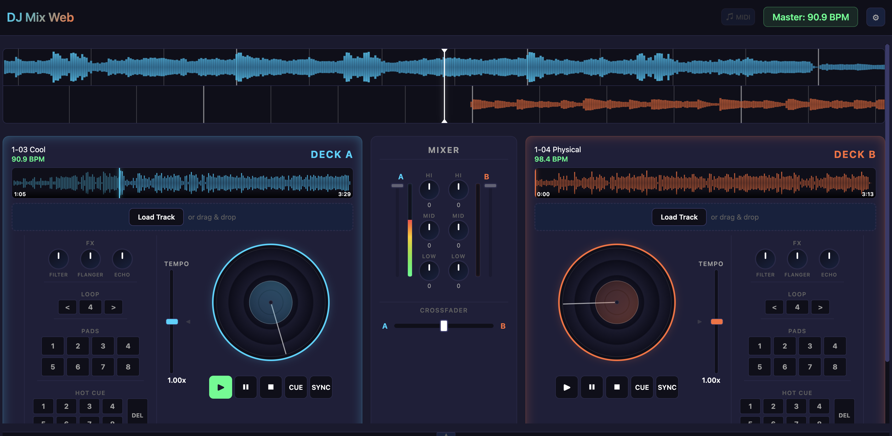

# 🎧 WebDJ — Software Profesional de Mezcla para Navegador

[](https://developer.mozilla.org/en-US/docs/Web/JavaScript)
[](https://developer.mozilla.org/en-US/docs/Web/API/Web_Audio_API)
[](https://developer.mozilla.org/en-US/docs/Web/API/Web_MIDI_API)
[](https://developer.mozilla.org/en-US/docs/Web/API/Canvas_API)
[](https://github.com/nelsoncabrera06/webDJ)
[](https://nelsoncabrera06.github.io/webDJ/)

> **Aplicación web de DJing de 2 decks y alto rendimiento, desarrollada desde cero con JavaScript puro, Web Audio API y Web MIDI API — sin frameworks, sin librerías externas y sin pasos de compilación (0 dependencias).**

🔗 **Probar la Demo en Vivo:**
https://nelsoncabrera06.github.io/webDJ/

---

## 📸 Vista de la Aplicación



---

## 🌟 Resumen del Proyecto

**WebDJ** es una estación de mezcla digital (DJ Software / DAW ligero) que corre de forma 100% nativa en el navegador. Implementa procesamiento de señales en tiempo real (DSP), análisis offline de audio PCM, visualización de formas de onda con Canvas a 60 FPS, soporte plug-and-play para controladores de DJ físicos por MIDI y un motor de sincronización automática basado en **PLL (Phase-Locked Loop)** similar al utilizado en software estándar de la industria como Pioneer Rekordbox, Serato o Traktor.

Fue concebido como un desafío de ingeniería para demostrar el poder de las APIs web modernas de bajo nivel para aplicaciones multimedia complejas y de latencia crítica.

---

## ✨ Características Principales

### 🎚️ Motor de Audio y Mezcla (Web Audio DSP)
- **Canales duales independientes (Deck A & Deck B)** con faders de volumen, VU meters estéreo en tiempo real y crossfader con curva de mezcla suave.
- **Ecualizador paramétrico de 3 bandas por canal:** Filtros Biquad (`lowshelf` a 250 Hz, `peaking` a 1000 Hz y `highshelf` a 4000 Hz) con respuesta analógica de -12 dB a +12 dB.
- **Racks de Efectos (FX):** Módulos integrados de Filtro (Low/High Pass), Flanger y Echo con control gradual mediante perillas rotativas custom.
- **Arquitectura de reproducción híbrida:** Streaming y decodificación combinando elementos `<audio>` con Web Audio nodes para permitir *time-stretching* nativo (`preservesPitch`).
- **Modos de Pitch seleccionables:**
  - *Linked (Keylock):* Modifica la velocidad del tema (BPM) manteniendo intacta la tonalidad musical original.
  - *Independent (Vinyl style):* Acelerar o frenar afecta la velocidad y el tono en tiempo real, replicando el comportamiento físico del vinilo. Control de semitonos (-12 a +12 st).

### 🔄 Sincronización Inteligente de Beats (Master/Slave PLL Sync)
- **Tempo Matching automático:** Detección y emparejamiento de BPM con resolución de octavas (manejo inteligente de relaciones *half-time* / *double-time* como 70 BPM vs 140 BPM).
- **Phase-Locked Loop (PLL) en tiempo real:** Corrección de fase mediante modulación suave y proporcional de velocidad (lazo cerrado), evitando los saltos abruptos o clics audibles al sincronizar dos canciones en marcha.
- **Detección offline de BPM y Beatgrid:** Algoritmo propio de autocorrelación y comb filter que identifica el tempo exacto y el *downbeat* (primer golpe del compás) analizando los transitorios de energía.

### 📊 Visualización de Audio de Alta Definición
- **Waveform general (Mini-Waveform):** Renderizado de amplitud RMS de toda la pista con marcas de hot cues, progreso de aguja y navegación interactiva por clic/drag.
- **Waveform continuo ampliado (Zoomed Scrolling Waveform):** Doble visualizador espejo sincronizado en tiempo real con indicador central de aguja (playhead), renderizado de beatgrid y adaptación dinámica de ventana temporal según el pitch.

### 💿 Jog Wheels & Platters Sensibles
- **Emulación de vinilo interactiva:** Detección de arrastre táctil y de ratón calculando velocidad angular (`Math.atan2`).
- **Scratching y Pitch Nudge:** Permite empujar o retener la pista con inercia física para ajustes manuales de fase y técnica de scratch.

### 🎛️ Herramientas de Performance
- **8 Hot Cues por deck:** Grabación instantánea de puntos clave, salto con latencia mínima y modo de borrado (`DEL`).
- **Beat Looper:** Creación de bucles rítmicos perfectos con opciones de duplicar (`>`) o dividir (`<`) el tamaño del loop al vuelo (1, 2, 4, 8, 16 beats).
- **8 Pads de interpretación** por deck para directos y disparos de muestras.
- **Auto-Mixer:** Modo de mezcla automática que detecta la proximidad del final de la pista y realiza una transición progresiva con crossfade inteligente hacia el deck opuesto.

### 📁 Gestión de Biblioteca y Playlist
- **Acceso directo al disco local:** Utiliza la moderna **File System Access API** (`window.showDirectoryPicker`) para explorar carpetas completas del disco duro sin subir archivos a ningún servidor.
- **Arrastrar y soltar (Drag & Drop):** Carga archivos de audio (`.mp3`, `.wav`, `.ogg`, `.flac`, `.m4a`) directamente sobre los decks o hacia la lista de reproducción.
- **Panel colapsable y redimensionable** para maximizar el área de trabajo en pantallas pequeñas.
- **Auto-load inteligente:** Carga automática del siguiente tema de la playlist al finalizar la pista activa.

### 🎹 Soporte de Hardware Web MIDI
- Integración plug-and-play sin drivers mediante la **Web MIDI API**.
- Mapeado de fábrica listo para el controlador físico **Behringer CMD Studio 4A** (jog wheels relativos, faders de canal, crossfader, perillas de EQ, pads de hot cue, pitch bend de alta resolución y retroalimentación bidireccional por LEDs).

---

## 🏗️ Arquitectura Técnica y Flujo de Señal

El sistema está estructurado bajo un patrón desacoplado y orientado a eventos. El módulo central `AudioEngine` gestiona el grafo de Web Audio y notifica cambios de estado mediante un bus de eventos propio hacia los controladores de UI y visualizadores.

### Grafo de Audio (Audio Signal Flow)

```
[ Archivo de Audio ]
        │
        ▼
[ Decodificador PCM Offline ] ──► [ BPMDetector ] ──► BPM + Beatgrid Offset
        │
        ▼
[ WaveformGenerator ] ──────────► Formas de onda Mini & Zoomed en Canvas
        │
        ▼
   <audio> Element (Deck A / B)  [Control de playbackRate y preservesPitch]
        │
        ▼
 MediaElementAudioSourceNode
        │
        ▼
   BiquadFilterNode (Low Shelf @ 250 Hz)
        │
        ▼
   BiquadFilterNode (Peaking Mid @ 1000 Hz)
        │
        ▼
   BiquadFilterNode (High Shelf @ 4000 Hz)
        │
        ▼
   GainNode (Fader de Canal A / B)
        │
        ├──► AnalyserNode (Cálculo RMS para VU Meter)
        │
        ▼
   GainNode (Curva de Crossfader)
        │
        ▼
   GainNode (Master Volume)
        │
        ▼
   audioContext.destination (Salida a Altavoces / Auriculares)
```

### 🔬 ¿Por qué elementos `<audio>` en lugar de `AudioBufferSourceNode` para la reproducción?
En Web Audio, reproducir archivos grandes mediante `AudioBufferSourceNode` requiere decodificar el archivo completo en memoria RAM sin comprimir (un tema de 5 minutos ocupa más de 50 MB de memoria de audio) y no cuenta con soporte nativo para *time-stretching* con retención de tono.

En cambio, este proyecto implementa una **arquitectura híbrida**:
1. Los elementos `<audio>` manejan el streaming y la decodificación de bajo costo con soporte de la propiedad nativa `preservesPitch`.
2. Dicha salida se inyecta en el grafo Web Audio a través de un `MediaElementAudioSourceNode`, permitiendo aplicar procesamiento en tiempo real (EQ, filtros, análisis espectral, crossfader y volumen máster).
3. De forma paralela y asíncrona, se utiliza un `AudioBuffer` únicamente para el análisis matemático del BPM y la generación estática de las formas de onda.

---

## 🧮 Algoritmo de SYNC: Sincronización Profesional por PLL

Uno de los mayores retos técnicos del software de DJ es lograr que dos canciones se sincronicen sin "saltos" molestos. La mayoría de proyectos amateurs intentan sincronizar forzando un salto de tiempo (`currentTime = targetTime`), lo que provoca chasquidos (*pops/clicks*) y desfase del buffer.

En este proyecto se implementó un **Lazo de Enganche de Fase (PLL — Phase-Locked Loop)** continuo de control proporcional:

```
                      ┌──────────────────────────────────────┐
                      │ 1. Cálculo del error de fase          │
                      │    error = fase_master - fase_slave  │
                      └──────────────────┬───────────────────┘
                                         │
                                         ▼
                      ┌──────────────────────────────────────┐
                      │ 2. Filtro pasa-bajos EMA             │
                      │    (Elimina jitter y microvariaciones│
                      └──────────────────┬───────────────────┘
                                         │
                                         ▼
                      ┌──────────────────────────────────────┐
                      │ 3. Corrección proporcional           │
                      │    corr = error * PLL_KP             │
                      │    (limitada suavemente a ±4%)       │
                      └──────────────────┬───────────────────┘
                                         │
                                         ▼
                      ┌──────────────────────────────────────┐
                      │ 4. Modulación de playbackRate        │
                      │    El slave acelera/frena de forma   │
                      │    imperceptible hasta enganchar     │
                      └──────────────────────────────────────┘
```

- **Octave Resolver:** Identifica si dos temas están en una relación de compás doble o mitad (por ejemplo, mezclar Drum & Bass a 174 BPM con Hip-Hop a 87 BPM) y empareja el ratio sin alterar excesivamente el tono.
- **Deadband Window:** Si el error de fase es inferior al 0.2% de un beat, no se aplica corrección para evitar oscilaciones innecesarias (*hunting*).
- **Transición ininterrumpida:** Al hacer scratch o empujar el platter manualmente, el PLL suspende temporalmente la corrección para priorizar la interacción humana sin pelear con el DJ.

---

## 🎹 Mapeo Web MIDI (Behringer CMD Studio 4A)

El proyecto incluye soporte nativo y automático para controladores DJ por USB/MIDI. Las asignaciones predeterminadas corresponden al controlador **Behringer CMD Studio 4A**:

| Control de Hardware | Tipo MIDI | Canal / Nota / CC | Acción en WebDJ |
|---|---|---|---|
| **Play / Pause** | Note On/Off | Ch 0: N 44 / Ch 1: N 76 | Reproducir / Pausar Deck A / B |
| **Cue** | Note On/Off | Ch 0: N 43 / Ch 1: N 75 | Volver al punto Cue / Establecer Cue |
| **Sync** | Note On/Off | Ch 0: N 45 / Ch 1: N 77 | Activar/Desactivar Master-Slave SYNC |
| **Jog Wheel** | CC Relativo | Ch 0: CC 26 / Ch 1: CC 58 | Scratching y Pitch Nudge dinámico |
| **Fader de Volumen** | CC (0-127) | Ch 0: CC 112 / Ch 1: CC 113 | Control de volumen de canal A / B |
| **Crossfader** | CC (0-127) | Ch 0: CC 114 | Transición estéreo entre canales |
| **EQ High / Mid / Low** | CC (0-127) | CC 96-98 (Deck A) / CC 99-101 (Deck B) | Ecualización de 3 bandas (-12 a +12 dB) |
| **Pitch Fader** | Pitch Bend | Ch 0 / Ch 1 (14-bit) | Ajuste fino de tempo (0.50x a 1.50x) |
| **Hot Cues (1 al 8)** | Note On/Off | Ch 0: N 34-41 / Ch 1: N 66-73 | Disparo / Guardado de Hot Cues 1-8 |
| **Loop (/2, x2, ON)** | Note On/Off | Ch 0: N 23-25 / Ch 1: N 55-57 | Manipulación de bucles rítmicos |
| **LED Feedback** | MIDI Output | Note On con velocity 127/0 | Iluminación de botones en el hardware |

---

## ⌨️ Atajos de Teclado (Laptop Mixing)

Puedes realizar una sesión completa de mezcla usando únicamente el teclado de tu computadora:

### Deck A (Lado Izquierdo)
- `Q` — Reproducir (*Play*)
- `W` — Pausar (*Pause*)
- `E` — Detener y volver al inicio (*Stop*)
- `A` — Punto CUE
- `S` — Activar SYNC
- `1` / `2` / `3` / `4` — Disparar Hot Cues 1 al 4
- `Shift` + `↑` / `↓` — Ajustar tempo (+1% / -1%)

### Deck B (Lado Derecho)
- `U` — Reproducir (*Play*)
- `I` — Pausar (*Pause*)
- `O` — Detener y volver al inicio (*Stop*)
- `J` — Punto CUE
- `K` — Activar SYNC
- `7` / `8` / `9` / `0` — Disparar Hot Cues 1 al 4
- `Shift` + `→` / `←` — Ajustar tempo (+1% / -1%)

### Mixer Global
- `Z` — Crossfader hacia todo Deck A
- `X` — Crossfader al centro (50% / 50%)
- `C` — Crossfader hacia todo Deck B
- `Espacio` — Alternar Play/Pause en el deck activo

---

## 📂 Estructura del Código

El proyecto sigue una estructura limpia, modular y desacoplada:

```
DJmix_web/
├── css/
│   ├── browser.css           # Estilos del explorador de archivos y playlist
│   ├── deck.css              # Controles de transporte, pads, cues y tempo
│   ├── mixer.css             # Faders de volumen, medidores VU y ecualizador
│   ├── platter.css           # Estilizado y animación de vinilos / jog wheels
│   ├── styles.css            # Estructura global, variables CSS y header
│   └── waveform.css          # Contenedores de canvas y playhead indicador
├── images/
│   └── working.png           # Captura de pantalla de la aplicación
├── investigaciones/
│   ├── README.md             # Notas técnicas de investigación
│   └── sync.md               # Estudio matemático y teórico sobre SYNC y PLL
├── js/
│   ├── app.js                # Raíz de composición (DJMixApp): orquesta componentes y teclado
│   ├── audioEngine.js        # Núcleo Web Audio: nodos DSP, PLL, EQ, volumen y eventos
│   ├── autoMixer.js          # Lógica para transiciones y crossfade automático
│   ├── bpmDetector.js        # Detección de BPM por autocorrelación y beatgrid comb filtering
│   ├── browser.js            # Integración con File System Access API y Playlist
│   ├── deck.js               # Controlador de interfaz para cada deck (DeckController)
│   ├── knob.js               # Componente reutilizable de perillas rotativas custom
│   ├── midi.js               # Conexión Web MIDI y mapeo para Behringer CMD Studio 4A
│   ├── mixer.js              # Controlador visual del mixer y faders (MixerController)
│   ├── platter.js            # Lógica física del jog wheel (arrastre, inercia y scratching)
│   ├── utils.js              # Funciones auxiliares matemáticas y bus de eventos EventEmitter
│   └── waveformGenerator.js  # Renderizador en HTML5 Canvas (Mini y Zoomed Waveforms)
├── index.html                # Markup semántico de la aplicación
└── README.md                 # Documentación técnica del proyecto
```

---

## 🚀 Puesta en Marcha en Local

Dado que la aplicación hace uso de APIs de seguridad avanzadas del navegador (como la **Web Audio API** y la **File System Access API**), el archivo no debe abrirse mediante el protocolo `file://`. Debe ser servido a través de un contexto seguro (`http://localhost` o HTTPS).

### Requisitos
- Navegador web moderno basado en **Chromium** (Google Chrome, Brave, Microsoft Edge, Opera). *(Firefox y Safari aún no ofrecen soporte pleno para la File System Access API ni Web MIDI API).*

### Pasos

1. **Clonar el repositorio:**
   ```bash
   git clone https://github.com/nelsoncabrera06/webDJ.git
   cd webDJ
   ```

2. **Levantar un servidor local estático** (utiliza la herramienta que prefieras):
   - Con **Python 3**:
     ```bash
     python3 -m http.server 8000
     ```
   - Con **Node.js** (`npx`):
     ```bash
     npx serve .
     ```
   - Con la extensión **Live Server** de VS Code.

3. **Abrir en el navegador:**
   Visita `http://localhost:8000` en tu navegador.

4. **Comenzar a mezclar:**
   - Haz clic en la pantalla de bienvenida (**"Click to start"**) para desbloquear el `AudioContext` (requerimiento de seguridad de los navegadores para reproducción de audio).
   - Haz clic en **"Load Track"** o arrastra pistas de música a los Decks A y B.
   - ¡Conecta tu controlador MIDI por USB y se reconocerá automáticamente!

---

## 🛠️ Tecnologías y APIs Web Utilizadas

- **JavaScript ES6+:** Programación orientada a objetos modular, `async/await`, EventEmitters.
- **Web Audio API:** `AudioContext`, `BiquadFilterNode`, `GainNode`, `AnalyserNode`, `MediaElementAudioSourceNode`.
- **HTML5 `<audio>` & `<canvas>`:** Procesamiento gráfico acelerado por hardware a 60 FPS y streaming de audio con time-stretching nativo (`preservesPitch`).
- **Web MIDI API:** Comunicación serial por hardware con controladores externos en tiempo real.
- **File System Access API:** Lectura y exploración de directorios locales con permisos nativos del sistema de archivos del usuario.
- **CSS3 Moderno:** CSS Grid, Flexbox, Custom Properties (variables CSS) y animaciones de rotación.

---

## 👤 Autor

Desarrollado con dedicación por **Nelson Cabrera**.

- **GitHub:** [@nelsoncabrera06](https://github.com/nelsoncabrera06)
- **Repositorio:** [webDJ en GitHub](https://github.com/nelsoncabrera06/webDJ)
- **Demo en Producción:** [https://nelsoncabrera06.github.io/webDJ/](https://nelsoncabrera06.github.io/webDJ/)

---

⭐ Si este proyecto te resultó interesante o útil para aprender sobre Web Audio API y procesamiento de señales en el navegador, ¡no olvides dejarle una estrella en GitHub!
